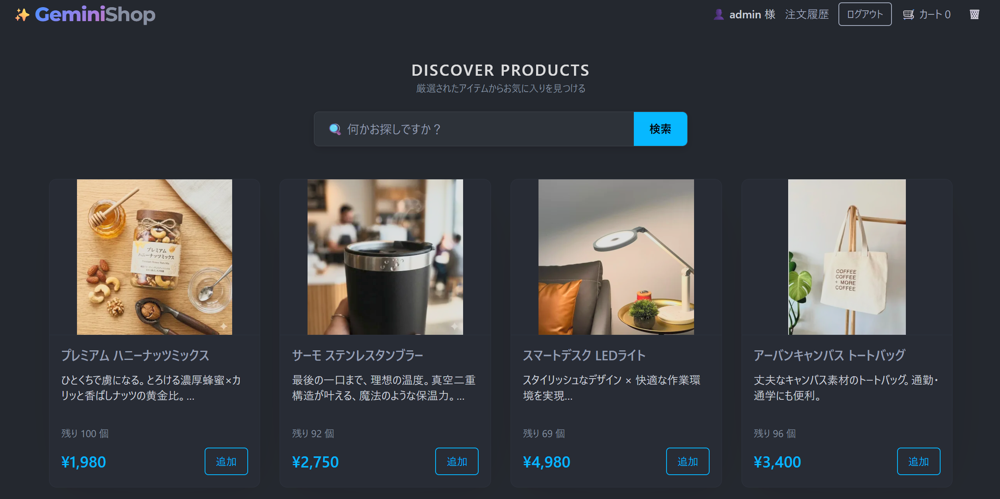
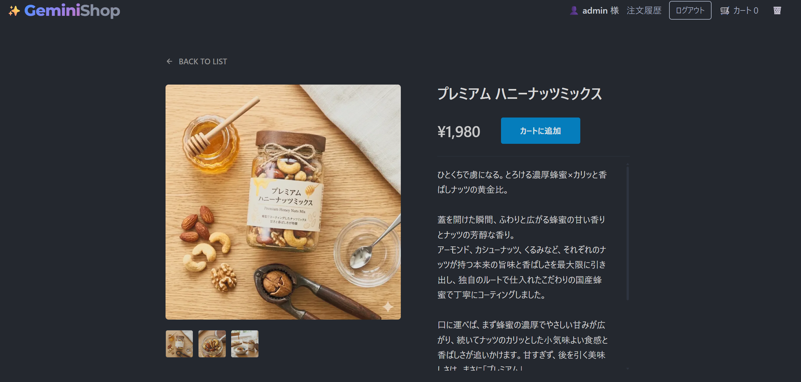
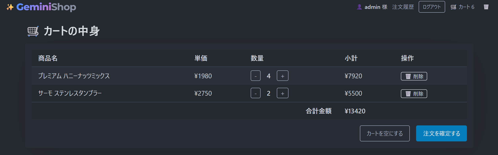
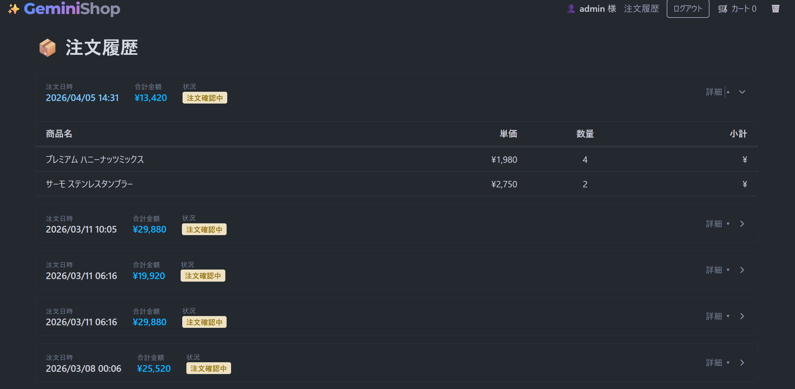
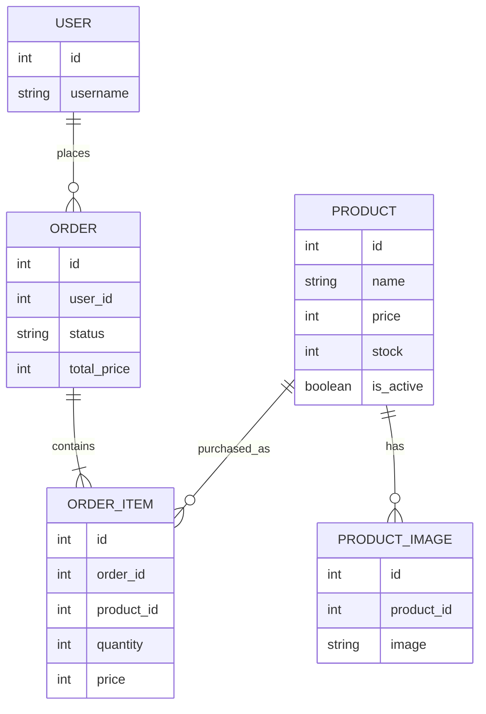
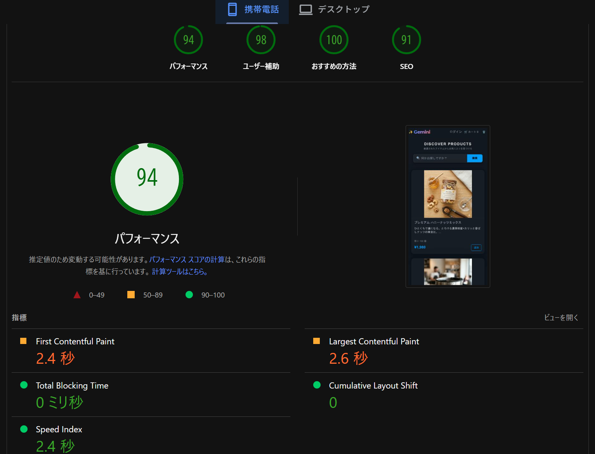

# Gemini Portfolio Shop

Django を使って、商品一覧、認証、カート、注文、在庫更新、管理画面といった
バックエンドで頻出する責務を一通り扱うために作成した EC サイトです。

フロントエンドは Pico CSS と HTMX を採用し、JavaScript フレームワークを使わずに
SPA ライクな操作感をできるだけシンプルな構成で実現することを目指しました。
学習の主軸をサーバーサイドの設計とデータ整合性に置きつつ、UI 側の体験も崩さないことを重視しています。

## Demo

- URL: [https://django-ec-portfolio.onrender.com](https://django-ec-portfolio.onrender.com)
- Guest account
  - ID: `guest_user`
  - Password: `guest_password123`

ログイン後は、商品閲覧、カート追加、数量変更、注文完了、注文履歴の流れを確認できます。

> Note
> Render / Supabase の無料枠を利用しているため、初回アクセス時や一定期間未使用後は表示に時間がかかる場合があります。
> まれに DB 側の復帰が必要になることがありますが、その場合もアプリ構成とデモアカウントは維持しています。

## このプロジェクトで扱いたかったこと

- Django を使った CRUD だけでなく、注文処理や在庫更新のような状態変化を伴う処理を実装すること
- 認証、管理画面、ストレージ、デプロイ、監視まで含めて、実運用に近い構成を一通り経験すること
- フロントエンドの複雑な状態管理を避けつつ、部分更新による軽快な UX を実現すること
- 技術選定に対して「なぜそれを選んだか」を説明できる構成にすること

## 開発の進め方

要件整理や実装方針の壁打ちには生成 AI を補助的に使いましたが、
実際の技術選定、実装内容の取捨選択、動作確認、デプロイ調整は自分で行っています。

特にこのプロジェクトでは、
「提案されたコードをそのまま使う」のではなく、
ローカルで検証しながら必要な形に直し、最終的に自分で説明できる状態にすることを重視しました。

## 技術選定

### Django

EC サイトでは、商品、注文、ユーザー、在庫など、サーバーサイドで扱う責務が多くあります。
認証、ORM、管理画面、テンプレート、フォームなどをまとめて扱える Django は、
今回の学習目的に対して最も相性が良いと判断しました。

### HTMX + Pico CSS

今回はフロントエンドの高度な状態管理を学ぶことよりも、
バックエンドの整合性設計と注文処理に集中することを優先しました。

また、React や Vue のようなフロントエンドフレームワークを導入すると、
今回の主目的に対して学習コストが大きくなり、
バックエンドの設計と実装に割ける時間が減ると判断しました。

そのため、UI はできるだけ軽量に保ちつつ、
商品検索、カート件数更新、在庫表示更新などの体験を損なわないように
HTMX による部分更新を採用しています。

Pico CSS は、ビルド不要でシンプルに見た目を整えられるため、
アプリケーションの本質ではない部分に過剰な複雑性を持ち込まない目的で選びました。

## 主な機能

- 商品一覧表示
- 商品詳細表示
- キーワード検索
- ログイン / ログアウト
- カート追加
- カート内の数量変更 / 削除 / 全削除
- 注文確定
- 注文履歴表示
- Django Admin からの商品管理
- Cloudinary を使った商品画像管理

## Screenshots

### Home

商品一覧画面です。検索、在庫表示、カート導線をトップで確認できます。



### Product Detail

商品詳細画面です。商品画像、価格、説明、カート追加導線を確認できます。



### Checkout

カート / チェックアウト画面です。数量変更、合計金額、注文確定までの流れを確認できます。



### Order History

ログイン後の注文履歴画面です。購入後データの保持とユーザー向け機能を確認できます。



## ER Diagram



## 実装上のポイント

### 1. データ整合性を優先した注文処理

- `transaction.atomic()` で注文作成と在庫更新をひとまとまりの処理として扱っています
- `select_for_update()` により、同時注文時の在庫競合を防ぐ構成にしています
- `F()` 式で在庫減算を DB に寄せ、アプリケーション側の競合リスクを減らしています
- `OrderItem.price` に購入時価格を保存し、商品価格変更後も過去注文の整合性を保てるようにしています

### 2. Model レベルでの防衛線

- `price` と `stock` に `MinValueValidator` を設定
- さらに `CheckConstraint` を追加し、DB レベルでも負の値を防止

### 3. 軽量な SPA 風体験

- HTMX を利用して、検索結果、カート件数、在庫表示、メッセージを部分更新
- `hx-swap-oob` を使い、1 回のレスポンスで複数箇所を同期更新
- JavaScript は補助的な演出に限定し、主導権は Django 側に置いています

### 4. 開発・運用まわり

- GitHub Actions で lint, type check, test, deploy を自動化
- Ruff / mypy / pytest を導入
- Render へデプロイ
- Sentry によるエラー監視
- Supabase PostgreSQL を本番 DB として利用

## 苦労した点

最も苦労したのはデプロイ周りです。
ローカルでは動作していても、本番では `Render + Supabase + Cloudinary` の組み合わせで環境変数、静的ファイル設定、DB 接続状態が噛み合わず、公開 URL で安定して動かすまでに何度も調整が必要でした。

特に、Django 6 系の staticfiles 設定、Cloudinary との整合、無料枠サービス特有の停止・復帰挙動を踏まえて、
「ローカルで動く」ではなく「本番で継続して確認できる」状態を作る難しさを学べたのが大きな収穫でした。

## Tech Stack

- Backend: Python 3.14.3, Django 6.0.2
- Frontend: HTMX 2.0, Pico CSS 2
- Database: PostgreSQL (Supabase)
- Storage: Cloudinary
- Monitoring: Sentry
- Deployment: Render
- Tooling: uv, Ruff, mypy, pytest, GitHub Actions

## テストと品質管理

現在は主に以下を確認しています。

- 商品モデルのバリデーション
- 注文成功時の在庫減算
- 在庫不足時のロールバック
- 同時注文時に在庫が負にならないこと

品質担保のため、CI では以下を実行しています。

- `ruff check .`
- `mypy .`
- `python manage.py check`
- `pytest`

## Performance

JavaScript の依存を最小限にした構成により、
モバイル環境でも比較的高いパフォーマンスを維持できるよう意識しています。



- Performance: 94
- Accessibility: 98
- Best Practices: 100
- SEO: 91

## ローカル起動

### 1. Clone

```bash
git clone https://github.com/estorl03-tech/django-practice.git
cd django-practice
```

### 2. Install dependencies

```bash
uv sync
```

### 3. Configure environment variables

`.env` を作成し、必要に応じて以下を設定します。

```env
DEBUG=True
SECRET_KEY=your-secret-key
ALLOWED_HOSTS=127.0.0.1,localhost
DATABASE_URL=
SENTRY_DSN=
CLOUDINARY_CLOUD_NAME=
CLOUDINARY_API_KEY=
CLOUDINARY_API_SECRET=
```

`DATABASE_URL` を設定しない場合は SQLite で起動します。

### 4. Run

```bash
uv run python manage.py migrate
uv run python manage.py runserver
```

## 今後の改善候補

次に着手するなら、優先順位は以下の順です。

1. View / integration テストの拡充
2. 構成図の追加
3. UX 改善

## 補足

このプロジェクトでは、モダンな技術をただ並べることよりも、
「何を学びたいか」に対して過不足のない技術選定をすることを重視しました。

特に、バックエンドで重要になる整合性、責務分離、運用を意識した構成を
自分の言葉で説明できるポートフォリオにすることを目的にしています。
